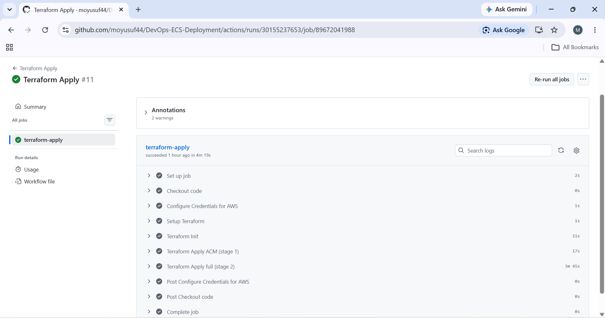
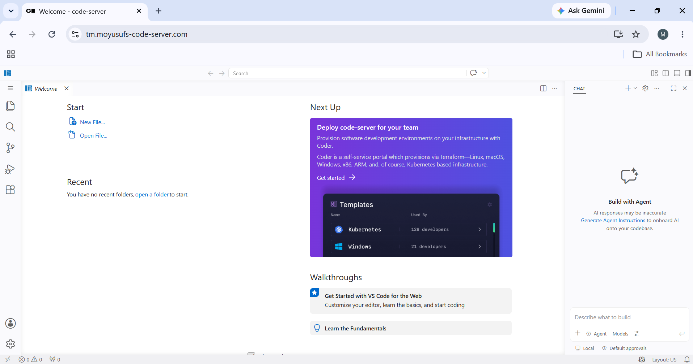

# Code Server AWS ECS Deployment Project

# Overview

This project deploys a self-hosted VS Code environment using **code-server** on AWS ECS Fargate.

The infrastructure is managed using **Terraform** and includes:

- AWS VPC with public subnets
- ECS Fargate cluster running code-server
- Amazon ECR for Docker image storage
- Application Load Balancer for traffic routing
- ACM certificate for HTTPS
- Cloudflare DNS management
- GitHub Actions CI/CD pipeline
- Terraform remote state stored in Amazon S3

The application is accessible through a custom domain with HTTPS enabled.

---

# Architecture


# The deployment flow:

User > HTTPS > Cloudflare DNS > Application Load Balancer > AWS ECS Fargate > Code Server Container > ECR Docker Image

---

## Technologies Used

- AWS ECS Fargate
- AWS ECR
- AWS ALB
- AWS ACM
- Terraform
- Docker
- Cloudflare DNS
- GitHub Actions
- Linux

## Deployment Process

1. Docker image is built for code-server.
2. Image is pushed to Amazon ECR.
3. Terraform creates AWS infrastructure intwo steps firstly making the ACM Certificate then the rest of the      components using Infrastructure as Code.
4. ECS launches the container using the ECR image.
5. ACM provides HTTPS certificates.
6. Cloudflare manages DNS records.
7. Application becomes available through the custom domain "tm.moyusufs-code-server.com" and "moyusufs-code-server.com"

# CI/CD Pipeline

GitHub Actions automates deployment:

- Builds Docker image
- Pushes image to ECR
- Runs Terraform
- Deploys infrastructure changes

## Terraform Backend Setup

This project uses a remote Terraform backend to store state securely and prevent concurrent Terraform operations.

The backend infrastructure consists of:

- **Amazon S3** - Stores the Terraform state file remotely.
- **Amazon DynamoDB** - Provides state locking to prevent multiple Terraform operations from running at the same time.

The DynamoDB Table should not be destroyed.
Apply only needed once. 


# Successful Deployment



# Application Running Through Domain


---

## Security Group Design

ECS Security groups are managed through the VPC Terraform module and attached to the required AWS resources.


### Application Load Balancer Security Group

Created within the ALB module and allows inbound web traffic:

- HTTP (port 80)
- HTTPS (port 443)

The ALB receives user traffic and forwards requests to the ECS service.

### ECS Service Security Group

Created within the VPC module and attached to the ECS Fargate service.

The ECS security group only allows inbound traffic from the ALB security group, preventing direct access to the container.


---

# How To Reproduce

## Requirements

Install:

- Terraform
- Docker
- AWS CLI
- Cloudflare account with purchased domain

## Steps

Clone the repository:

```bash
git clone <repository-url>
```
pull it
cd Infrastructure-terra

Navigate to the Terraform directory:

```bash
cd Infrastructure-terra
```

Initialise Terraform:

```bash
terraform init
```

Validate the Terraform configuration:

```bash
terraform validate
```

Preview the infrastructure changes:

```bash
terraform plan
```

Deploy the infrastructure:

```bash
terraform apply -auto-approve
```

Terraform will create:

- VPC and networking
- ECS Fargate cluster
- ECR repository
- Application Load Balancer
- ACM SSL certificate
- Cloudflare DNS records

After deployment, access the application using:

```
https://tm.your-domain.com
```


Login using the password configured in `code_server_password`.


# CI/CD Deployment

Destroy what you have just created using:

```bash
terraform destroy
```

The project uses GitHub Actions to automate:

- Builds Docker image
- Pushes image to ECR
- Runs Terraform
- Deploys infrastructure changes

Required GitHub Secrets:

```
AWS_ACCESS_KEY_ID
AWS_SECRET_ACCESS_KEY_ID
AWS_REGION
CLOUDFLARE_API_TOKEN
CODE_SERVER_PASSWORD
```

CICD info:
workflows can be run in github using workflow dispatch

The application runs using:

- Docker container running code-server
- Amazon ECS Fargate for container hosting
- Application Load Balancer for traffic routing
- ACM for HTTPS certificates
- Cloudflare for DNS management


# Troubleshooting

## Common Issues
If the plan ever gets stuck in github actions not all variables have been provided in the code.

### Terraform Provider Errors

If Terraform providers fail to initialise, update the providers:

```bash
terraform init -upgrade
```

### ACM Certificate Validation

The ACM certificate uses DNS validation through Cloudflare.

If the certificate remains in `PENDING_VALIDATION`:

1. Check that the Cloudflare API token has the required DNS permissions.
2. Confirm the validation records exist:

```bash
terraform state list | grep cloudflare
```

3. Wait for AWS ACM to verify the DNS records.


### ECS Container Health Check

If the ECS task is unhealthy:

Check:

- Container port matches the target group port.
- Security groups allow traffic.
- The ECS task is running.

Useful AWS CLI command:

```bash
aws ecs describe-services \
--cluster code-server-cluster-terra \
--services code-server-service-terra
```

---

### Cloudflare 522 Error

A Cloudflare 522 usually means Cloudflare cannot reach the AWS Load Balancer.

Check:

- ALB is running.
- ECS target is healthy.
- DNS record points to the ALB.
- Cloudflare proxy settings.

## Possible Improvements

Future improvements that could make the deployment more production-ready:

- Add ECS auto scaling. 
- Add monitoring and alerts using CloudWatch. 
- Add a custom domain health check. 
- Improve container security with stricter IAM permissions.

## Author

Mohamed Mahmoud Yusuf

Cloud / DevOps Project

Skills demonstrated:

- Linux
- Bash
- Docker
- AWS
- Terraform
- CI/CD
- Cloud Networking
- S3 Buckets